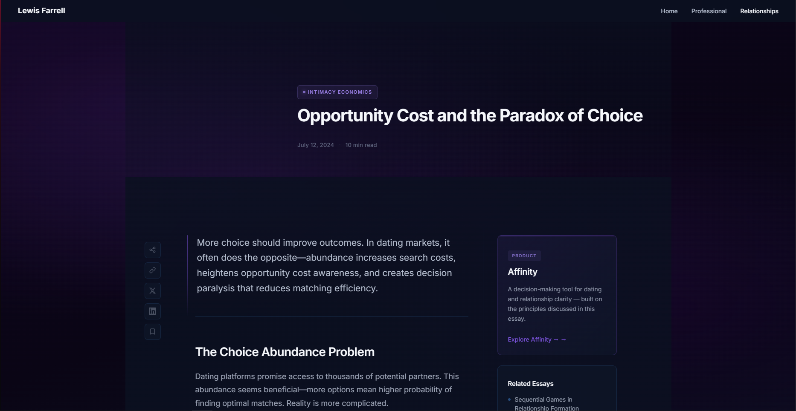

<main class="portal">

  <!-- Bio panel -->
  

    

    

      

        
        
LF

      

      

        <h1 class="bio-name">Lewis Farrell</h1>
        
Consultant ~ Intimacy Economist

        

Professionally, I design and implement data systems for organisations.

Intellectually, I explore intimacy through economics, game theory, and anthropology.

        
Oxford · Management Consultant · Woodhurst

      

    

  

  <!-- Professional -->
  <a href="/professional" class="portal-panel panel-professional">
    

    <!-- Background scene: network / systems diagram -->
    

      <svg class="scene-pro" viewBox="0 0 960 560" preserveAspectRatio="xMidYMid slice" xmlns="http://www.w3.org/2000/svg">
        <!-- Connection lines -->
        <g stroke="rgba(77,163,255,0.10)" stroke-width="1" fill="none">
          <line x1="160" y1="140" x2="320" y2="80"/>
          <line x1="160" y1="140" x2="280" y2="280"/>
          <line x1="320" y1="80"  x2="460" y2="160"/>
          <line x1="320" y1="80"  x2="540" y2="60"/>
          <line x1="280" y1="280" x2="460" y2="160"/>
          <line x1="280" y1="280" x2="420" y2="460"/>
          <line x1="460" y1="160" x2="640" y2="200"/>
          <line x1="460" y1="160" x2="580" y2="380"/>
          <line x1="540" y1="60"  x2="640" y2="200"/>
          <line x1="540" y1="60"  x2="760" y2="120"/>
          <line x1="640" y1="200" x2="580" y2="380"/>
          <line x1="640" y1="200" x2="760" y2="120"/>
          <line x1="580" y1="380" x2="800" y2="340"/>
          <line x1="580" y1="380" x2="420" y2="460"/>
          <line x1="760" y1="120" x2="800" y2="340"/>
        </g>
        <!-- Leaf nodes -->
        <g fill="rgba(77,163,255,0.22)" stroke="rgba(77,163,255,0.12)" stroke-width="1">
          <circle cx="160" cy="140" r="3"/>
          <circle cx="540" cy="60"  r="3"/>
          <circle cx="800" cy="340" r="3"/>
          <circle cx="420" cy="460" r="3"/>
        </g>
        <!-- Hub nodes — pulse via CSS -->
        <g fill="rgba(77,163,255,0.35)" stroke="rgba(77,163,255,0.2)" stroke-width="1">
          <circle class="scene-hub" cx="320" cy="80"  r="4.5"/>
          <circle class="scene-hub" cx="460" cy="160" r="4.5"/>
          <circle class="scene-hub" cx="640" cy="200" r="4.5"/>
          <circle class="scene-hub" cx="580" cy="380" r="4.5"/>
          <circle class="scene-hub" cx="760" cy="120" r="4.5"/>
          <circle class="scene-hub" cx="280" cy="280" r="4.5"/>
        </g>
      </svg>
    

    

    <!-- Floating text content -->
    

      
Professional

      <h2 class="pc-title">Strategy &amp; Systems</h2>
      

        
Designing and implementing data systems for organisations — combining strategy, architecture, and technical delivery.

        

          Projects
          Reports
          Experience
          CV
        

        

          View Professional Work
          <svg xmlns="http://www.w3.org/2000/svg" fill="none" viewBox="0 0 24 24" stroke-width="2" stroke="currentColor">
            <path stroke-linecap="round" stroke-linejoin="round" d="M13.5 4.5 21 12m0 0-7.5 7.5M21 12H3"/>
          </svg>
        

      

    

  </a>

  <!-- Relationships -->
  <a href="/relationships" class="portal-panel panel-relationships">
    

    <!-- Background scene: organic gradient blobs -->
    

    

    <!-- Floating text content -->
    

      
Intimacy Economics

      <h2 class="pc-title">Dating &amp; Relationships</h2>
      

        
Essays, frameworks, and products on Intimacy Economics.

        

          Essays
          Ideas
          Affinity
          Book
        

        

          Explore Ideas
          <svg xmlns="http://www.w3.org/2000/svg" fill="none" viewBox="0 0 24 24" stroke-width="2" stroke="currentColor">
            <path stroke-linecap="round" stroke-linejoin="round" d="M13.5 4.5 21 12m0 0-7.5 7.5M21 12H3"/>
          </svg>
        

      

    

  </a>

</main>

<footer class="portal-bottom">
  

    Management Consultant
    
    Oxford Economics &amp; Management
    
    Intimacy Economist
  

  

    <a href="https://linkedin.com/in/-lewisfarrell-" target="_blank" rel="noopener">
      <svg xmlns="http://www.w3.org/2000/svg" viewBox="0 0 24 24" fill="currentColor">
        <path d="M20.447 20.452h-3.554v-5.569c0-1.328-.027-3.037-1.852-3.037-1.853 0-2.136 1.445-2.136 2.939v5.667H9.351V9h3.414v1.561h.046c.477-.9 1.637-1.85 3.37-1.85 3.601 0 4.267 2.37 4.267 5.455v6.286zM5.337 7.433a2.062 2.062 0 0 1-2.063-2.065 2.064 2.064 0 1 1 2.063 2.065zm1.782 13.019H3.555V9h3.564v11.452zM22.225 0H1.771C.792 0 0 .774 0 1.729v20.542C0 23.227.792 24 1.771 24h20.451C23.2 24 24 23.227 24 22.271V1.729C24 .774 23.2 0 22.222 0h.003z"/>
      </svg>
      LinkedIn
    </a>
    <a href="https://github.com/lewisfarrell" target="_blank" rel="noopener">
      <svg xmlns="http://www.w3.org/2000/svg" viewBox="0 0 24 24" fill="currentColor">
        <path d="M12 .297c-6.63 0-12 5.373-12 12 0 5.303 3.438 9.8 8.205 11.385.6.113.82-.258.82-.577 0-.285-.01-1.04-.015-2.04-3.338.724-4.042-1.61-4.042-1.61C4.422 18.07 3.633 17.7 3.633 17.7c-1.087-.744.084-.729.084-.729 1.205.084 1.838 1.236 1.838 1.236 1.07 1.835 2.809 1.305 3.495.998.108-.776.417-1.305.76-1.605-2.665-.3-5.466-1.332-5.466-5.93 0-1.31.465-2.38 1.235-3.22-.135-.303-.54-1.523.105-3.176 0 0 1.005-.322 3.3 1.23.96-.267 1.98-.399 3-.405 1.02.006 2.04.138 3 .405 2.28-1.552 3.285-1.23 3.285-1.23.645 1.653.24 2.873.12 3.176.765.84 1.23 1.91 1.23 3.22 0 4.61-2.805 5.625-5.475 5.92.42.36.81 1.096.81 2.22 0 1.606-.015 2.896-.015 3.286 0 .315.21.69.825.57C20.565 22.092 24 17.592 24 12.297c0-6.627-5.373-12-12-12"/>
      </svg>
      GitHub
    </a>
  

</footer>
